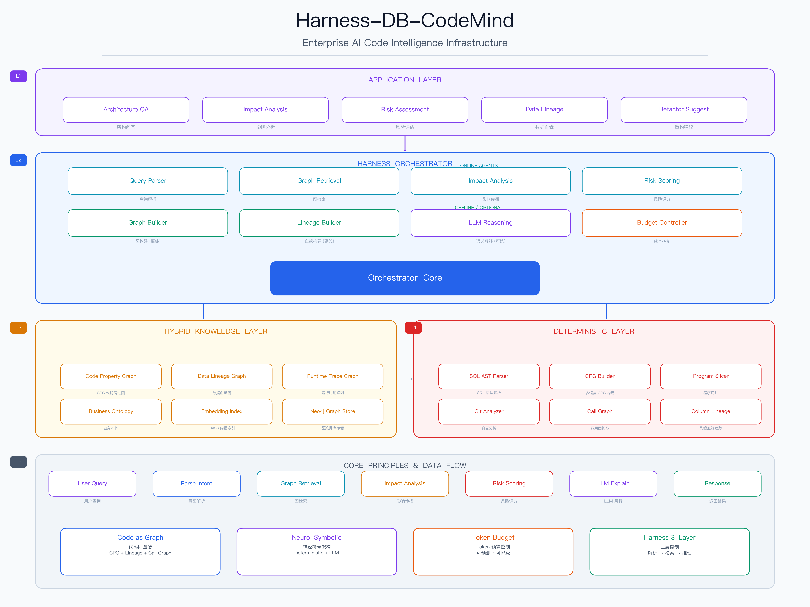

# Harness-DB-CodeMind

**企业级 AI 代码智能中枢（Code Intelligence Infrastructure）**

将企业存量代码从黑盒文本 → 可查询的图结构资产，实现 **Codebase Digital Twin（代码数字孪生系统）**。

---

## 目录

- [核心特性](#核心特性)
- [系统架构](#系统架构)
- [快速开始](#快速开始)
- [安装指南](#安装指南)
- [使用指南](#使用指南)
  - [CLI 命令行](#cli-命令行)
  - [Python API](#python-api)
  - [REST API](#rest-api)
- [核心概念](#核心概念)
  - [Code as Graph](#code-as-graph)
  - [Neuro-Symbolic 架构](#neuro-symbolic-架构)
  - [Token 预算控制](#token-预算控制)
- [Agent 详解](#agent-详解)
- [配置说明](#配置说明)
- [测试验证](#测试验证)
- [项目结构](#项目结构)
- [扩展路线](#扩展路线)

---

## 核心特性

| 能力 | 传统 RAG | 本系统 |
|------|---------|--------|
| 代码结构理解 | ❌ | ✅ Code Property Graph |
| Token 成本可控 | ❌ | ✅ 预算控制器 |
| 影响分析 | ❌ | ✅ BFS + 置信度传播 |
| 风险量化 | ❌ | ✅ 多因子风险评分 |
| 数据血缘 | ❌ | ✅ Column 级血缘追踪 |

---

## 系统架构



```
Application Layer
  ├── 架构问答
  ├── 影响分析
  ├── 重构建议

Harness Orchestrator（核心调度）
  ├── Query Parser Agent      → 自然语言 → 结构化查询
  ├── Graph Retrieval Agent    → Query-aware 图检索
  ├── Impact Analysis Agent    → BFS 影响传播
  ├── Risk Scoring Agent       → 多因子风险评分
  ├── LLM Reasoning Agent      → 语义解释（可选）
  └── Budget Controller Agent  → Token 成本控制

Hybrid Knowledge Layer
  ├── Code Property Graph (CPG)
  ├── Data Lineage Graph
  ├── Embedding Index (FAISS)
  └── Neo4j Graph Store

Deterministic Layer
  ├── SQL AST Parser（正则 + sqlparse）
  ├── CPG Builder（多语言）
  ├── Program Slicer
  └── Git Analyzer
```

---

## 快速开始

### 前置条件

- Python 3.10+
- pip

### 30 秒快速体验

```bash
# 1. 克隆项目
git clone <repo-url>
cd Harness-DB-CodeMind

# 2. 创建虚拟环境并安装
python3 -m venv .venv
source .venv/bin/activate
pip install -e ".[dev]"

# 3. 索引测试数据
codemind index tests/test_data/erp_stored_procedures.sql --language sql

# 4. 执行影响分析查询
codemind query "修改 orders 会影响什么？" --repo tests/test_data/erp_stored_procedures.sql

# 5. 执行风险评估
codemind query "修改 m_storage 的风险" --repo tests/test_data/erp_stored_procedures.sql

# 6. 启动 API 服务
codemind serve --port 8000
```

---

## 安装指南

### 步骤 1：获取代码

```bash
git clone <repo-url>
cd Harness-DB-CodeMind
```

### 步骤 2：创建虚拟环境

```bash
python3 -m venv .venv
source .venv/bin/activate  # Linux/macOS
# 或
.venv\Scripts\activate     # Windows
```

### 步骤 3：安装依赖

```bash
# 基础安装
pip install -e .

# 开发模式安装（含测试工具）
pip install -e ".[dev]"
```

### 步骤 4：配置环境变量

```bash
# 复制示例配置
cp .env.example .env

# 编辑 .env 文件，填入你的配置
# 必须配置的项：
#   OPENAI_API_KEY=sk-xxx       # LLM 解释功能需要
# 可选配置的项：
#   NEO4J_URI=bolt://localhost:7687
#   NEO4J_PASSWORD=your_password
```

### 步骤 5：验证安装

```bash
# 运行测试
python tests/test_core.py

# 运行 ERP 测试
python tests/test_erp.py
```

### 可选：安装 Neo4j（图数据库）

如果需要持久化图数据到 Neo4j：

```bash
# Docker 方式安装
docker run -d \
  --name neo4j \
  -p 7474:7474 -p 7687:7687 \
  -e NEO4J_AUTH=neo4j/your_password \
  neo4j:5

# 更新 .env 配置
# NEO4J_URI=bolt://localhost:7687
# NEO4J_PASSWORD=your_password
```

---

## 使用指南

### CLI 命令行

#### 索引代码仓库

```bash
# 索引单个 SQL 文件
codemind index /path/to/procedures.sql --language sql

# 索引整个目录（自动识别 .sql/.java/.py 文件）
codemind index /path/to/project --language sql

# 索引 Java 项目
codemind index /path/to/java-project --language java

# 索引 Python 项目
codemind index /path/to/python-project --language python

# 保存索引结果到文件
codemind index /path/to/project --output result.json
```

#### 查询代码智能

```bash
# 影响分析
codemind query "修改 orders 表会影响什么？"

# 风险评估
codemind query "修改 m_storage 的风险"

# 数据血缘
codemind query "c_invoice 的数据来源"

# 架构问答
codemind query "sp_complete_order 是做什么的"

# 指定仓库和 Token 预算
codemind query "修改 order.amount 会影响什么？" \
  --repo /path/to/project \
  --budget 4000

# 保存查询结果
codemind query "修改 orders 会影响什么？" --output result.json
```

#### 查看统计信息

```bash
codemind stats /path/to/project --language sql
```

#### 启动 API 服务

```bash
# 默认端口 8000
codemind serve

# 指定端口
codemind serve --port 9000

# 指定主机
codemind serve --host 0.0.0.0 --port 8000
```

### Python API

```python
from codemind.core.orchestrator import Orchestrator

# 创建编排器
orch = Orchestrator()

# 步骤 1：索引代码仓库
result = orch.index_repository("/path/to/project", language="sql")
print(f"索引完成: {result['node_count']} 个节点, {result['edge_count']} 条边")

# 步骤 2：执行查询
result = orch.query("修改 orders 会影响什么？")

# 解析结果
print(f"查询意图: {result['intent']}")
print(f"识别实体: {result['entities']}")

# 影响分析结果
if "impact" in result:
    impact = result["impact"]
    print(f"影响节点数: {impact['total_affected']}")
    print(f"最大深度: {impact['max_depth']}")
    print(f"平均置信度: {impact['avg_confidence']:.3f}")

    for imp in impact["impacts"]:
        print(f"  {imp['node_name']} ({imp['node_type']}) "
              f"深度={imp['depth']} 置信度={imp['confidence']:.3f}")

# 风险评分结果
if "risk" in result:
    risk = result["risk"]
    print(f"风险评分: {risk['score']}/100")
    print(f"风险等级: {risk['level']}")
    print(f"风险因素: {risk['factors']}")

# 血缘关系结果
if "lineage" in result:
    lineage = result["lineage"]
    for edge in lineage["lineage_edges"]:
        print(f"  {edge['source']} → {edge['target']} "
              f"[{edge['transformation']}] via={edge['via']}")

# LLM 解释（需要配置 OPENAI_API_KEY）
if "explanation" in result:
    print(f"AI 解释: {result['explanation']}")

# 查看图统计
stats = orch.get_graph_stats()
print(f"图统计: {stats}")
```

### REST API

启动服务后，可通过 HTTP 接口访问：

```bash
# 启动服务
codemind serve --port 8000
```

#### 健康检查

```bash
curl http://localhost:8000/health
# {"status": "ok", "service": "harness-db-codemind"}
```

#### 索引仓库

```bash
curl -X POST http://localhost:8000/index \
  -H "Content-Type: application/json" \
  -d '{"repo_path": "/path/to/project", "language": "sql"}'
```

#### 查询

```bash
curl -X POST http://localhost:8000/query \
  -H "Content-Type: application/json" \
  -d '{"query": "修改 orders 会影响什么？", "budget": 8000}'
```

#### 获取统计

```bash
curl http://localhost:8000/stats
```

#### 浏览节点

```bash
# 所有节点
curl http://localhost:8000/graph/nodes

# 按类型筛选
curl http://localhost:8000/graph/nodes?node_type=TABLE

# 按名称搜索
curl http://localhost:8000/graph/nodes?pattern=order
```

#### 浏览边

```bash
# 所有边
curl http://localhost:8000/graph/edges

# 按类型筛选
curl http://localhost:8000/graph/edges?edge_type=CALL
```

---

## 核心概念

### Code as Graph

系统将代码转换为三种图结构：

1. **Code Property Graph (CPG)**：函数/存储过程的调用关系、读写关系
2. **Data Lineage Graph**：列级数据血缘，追踪数据流向
3. **Call Graph**：过程间调用依赖

统一图模型：

```json
{
  "node": {
    "id": "proc_sp_order_pay",
    "type": "PROCEDURE",
    "name": "sp_order_pay",
    "qualified_name": "sp_order_pay"
  },
  "edge": {
    "source_id": "proc_sp_order_pay",
    "target_id": "table_orders",
    "type": "WRITE",
    "weight": 1.0
  }
}
```

### Neuro-Symbolic 架构

```
Deterministic Engine（图/规则）     LLM（语义解释）
┌─────────────────────┐          ┌─────────────────┐
│ SQL AST Parser      │          │ 架构问答         │
│ CPG Builder         │          │ 复杂逻辑解释     │
│ Program Slicer      │          │ 自然语言生成     │
│ Impact Propagation  │          │                  │
│ Risk Scoring        │          │                  │
└─────────────────────┘          └─────────────────┘
       ↑ 可计算、确定性                  ↑ 不可计算、语义
       ↑ 零 Token 消耗                  ↑ 有 Token 消耗
```

**核心原则**：LLM 仅参与"不可计算部分"，可预测 Token 消耗。

### Token 预算控制

每次查询都有预算，超预算自动降级：

```
Token 估算公式: Token = 节点数 × 25 + 边数 × 10

降级策略:
  超预算 → 减少图深度 (REDUCE_DEPTH)
         → 禁用 LLM (NO_LLM)
         → 最小化输出 (MINIMAL)
```

---

## Agent 详解

| Agent | 类型 | 职责 |
|-------|------|------|
| Graph Builder | 离线 | 构建 CPG + Call Graph，支持 SQL/Java/Python |
| Lineage Builder | 离线 | 解析 SQL AST，构建 Column 级血缘 |
| Query Parser | 在线 | 自然语言 → 结构化查询（意图 + 实体 + 约束） |
| Graph Retrieval | 在线 | Query-aware 图检索，BFS + 排名 |
| Impact Analysis | 在线 | BFS + 置信度衰减的影响传播 |
| Risk Scoring | 在线 | 多因子风险评分（6 个维度） |
| LLM Reasoning | 在线/可选 | 语义解释，仅在需要时触发 |
| Budget Controller | 在线 | Token 预算分配与降级策略 |

### 影响传播算法

```
BFS + confidence 衰减:

new_confidence = parent_confidence × edge_weight

edge_weight 按类型加权:
  LINEAGE: 0.95    WRITE: 0.85    CALL: 0.90
  READ: 0.70       REFERENCES: 0.60

低于阈值 (默认 0.1) 的节点被剪枝
```

### 风险评分公式

```
Risk = Σ(wi × fi)

因子及默认权重:
  blast_radius     (0.25)  - 影响范围
  critical_path    (0.20)  - 是否核心链路
  data_sensitivity (0.20)  - 数据敏感度
  change_frequency (0.15)  - 变更频率
  coupling         (0.10)  - 耦合度
  test_coverage    (0.10)  - 测试覆盖

风险等级:
  CRITICAL: ≥75    HIGH: ≥55    MEDIUM: ≥30    LOW: <30
```

---

## 配置说明

所有配置通过 `.env` 文件或环境变量管理：

| 变量 | 默认值 | 说明 |
|------|--------|------|
| `NEO4J_URI` | bolt://localhost:7687 | Neo4j 连接地址 |
| `NEO4J_USER` | neo4j | Neo4j 用户名 |
| `NEO4J_PASSWORD` | password | Neo4j 密码 |
| `OPENAI_API_KEY` | | OpenAI API Key（LLM 功能需要） |
| `OPENAI_MODEL` | gpt-4 | 使用的 LLM 模型 |
| `OPENAI_BASE_URL` | https://api.openai.com/v1 | API 基础 URL |
| `EMBEDDING_MODEL` | all-MiniLM-L6-v2 | 嵌入模型名称 |
| `TOKEN_BUDGET_DEFAULT` | 8000 | 默认 Token 预算 |
| `TOKEN_BUDGET_MAX` | 16000 | 最大 Token 预算 |
| `IMPACT_CONFIDENCE_THRESHOLD` | 0.1 | 影响传播置信度阈值 |
| `IMPACT_MAX_DEPTH` | 5 | 影响传播最大深度 |
| `RISK_WEIGHT_BLAST_RADIUS` | 0.25 | 风险因子：影响范围权重 |
| `RISK_WEIGHT_CRITICAL_PATH` | 0.20 | 风险因子：核心链路权重 |
| `RISK_WEIGHT_DATA_SENSITIVITY` | 0.20 | 风险因子：数据敏感度权重 |
| `RISK_WEIGHT_CHANGE_FREQUENCY` | 0.15 | 风险因子：变更频率权重 |
| `RISK_WEIGHT_COUPLING` | 0.10 | 风险因子：耦合度权重 |
| `RISK_WEIGHT_TEST_COVERAGE` | 0.10 | 风险因子：测试覆盖权重 |

---

## 测试验证

项目包含两套测试数据：

### 基础测试

```bash
python tests/test_core.py
```

测试内容：
- SQL Parser：INSERT/SELECT/UPDATE 语句解析
- CPG Builder：代码图构建
- Program Slicer：前向/后向切片
- Query Parser：意图识别和实体提取
- Lineage Builder：数据血缘提取
- Budget Controller：预算控制
- Orchestrator：端到端集成

### ERP 企业级测试

```bash
python tests/test_erp.py
```

使用模拟真实 ERP 系统（基于 ADempiere/iDempiere 模式）的 8 个复杂存储过程进行测试：

| 存储过程 | 功能 | 复杂度 |
|----------|------|--------|
| `sp_complete_order` | 订单完成处理 | 多表更新 + 级联操作 + 会计分录 |
| `sp_generate_invoice` | 发票生成 | 订单→发票 + 税务计算 |
| `sp_process_payment` | 付款处理 | 信用更新 + 会计分录 |
| `sp_move_inventory` | 库存移动 | 仓库间转移 + 事务记录 |
| `sp_close_period` | 月末结账 | 期间关闭 + 余额计算 + 试算平衡 |
| `sp_update_product_cost` | 产品成本计算 | 加权平均成本 + 成本历史 |
| `fn_check_credit` | 客户信用检查 | 信用额度评估（函数） |
| `sp_update_pricelist` | 价格列表计算 | 批量价格更新 + 利润率计算 |

**测试结果示例**：

```
索引结果: nodes=145, edges=60, tokens=4225

影响分析 - 修改 orders 表:
  影响节点数: 22
  最大深度: 4
  平均置信度: 0.501
  受影响节点:
    - sp_complete_order (PROCEDURE) depth=1 conf=0.680
    - sp_generate_invoice (PROCEDURE) depth=1 conf=0.560
    - m_inventory (TABLE) depth=2 conf=0.578
    - m_storage (TABLE) depth=2 conf=0.578
    - fact_acct (TABLE) depth=2 conf=0.578
    - c_bpartner (TABLE) depth=2 conf=0.578
  风险评分: 87.0/100 level=CRITICAL
```

---

## 项目结构

```
Harness-DB-CodeMind/
├── codemind/
│   ├── __init__.py
│   ├── cli.py                          # CLI 入口（click + rich）
│   ├── core/
│   │   ├── __init__.py
│   │   ├── models.py                   # 核心数据模型（Node/Edge/Graph/...）
│   │   ├── config.py                   # 配置管理（单例模式）
│   │   └── orchestrator.py             # 核心调度引擎
│   ├── agents/
│   │   ├── __init__.py
│   │   ├── base.py                     # Agent 基类
│   │   ├── graph_builder.py            # 代码图构建 Agent
│   │   ├── lineage_builder.py          # SQL 血缘构建 Agent
│   │   ├── query_parser.py             # 查询解析 Agent
│   │   ├── graph_retrieval.py          # 图检索 Agent
│   │   ├── impact_analysis.py          # 影响分析 Agent
│   │   ├── risk_scoring.py             # 风险评分 Agent
│   │   ├── llm_reasoning.py            # LLM 推理 Agent
│   │   └── budget_controller.py        # 预算控制 Agent
│   ├── deterministic/
│   │   ├── __init__.py
│   │   ├── sql_parser.py               # SQL AST 解析器
│   │   ├── cpg_builder.py              # CPG 构建器（多语言）
│   │   ├── program_slicer.py           # 程序切片器
│   │   └── git_analyzer.py             # Git 分析器
│   ├── knowledge/
│   │   ├── __init__.py
│   │   ├── neo4j_store.py              # Neo4j 图存储
│   │   └── embedding_index.py          # 向量索引（FAISS）
│   └── api/
│       ├── __init__.py
│       └── server.py                   # FastAPI 服务
├── tests/
│   ├── __init__.py
│   ├── test_core.py                    # 核心功能测试
│   ├── test_erp.py                     # ERP 场景测试
│   └── test_data/
│       ├── ecommerce_procedures.sql    # 电商存储过程
│       └── erp_stored_procedures.sql   # ERP 存储过程
├── pyproject.toml                      # 项目配置
├── .env.example                        # 环境变量示例
├── .gitignore
└── structure.md                        # 架构设计文档
```

---

## 扩展路线

1. **Change Decision Engine**：发布门禁，变更决策引擎
2. **自动重构建议**：基于图模式识别重构机会
3. **自学习权重**：基于历史事故数据调整风险因子权重
4. **Runtime + 静态融合分析**：结合运行时追踪和静态分析
5. **多仓库跨系统分析**：跨微服务的全局影响分析
6. **更多语言支持**：Go、Rust、C# 等
7. **Web UI**：可视化图浏览器和交互式查询界面

---

## 许可证

MIT License
