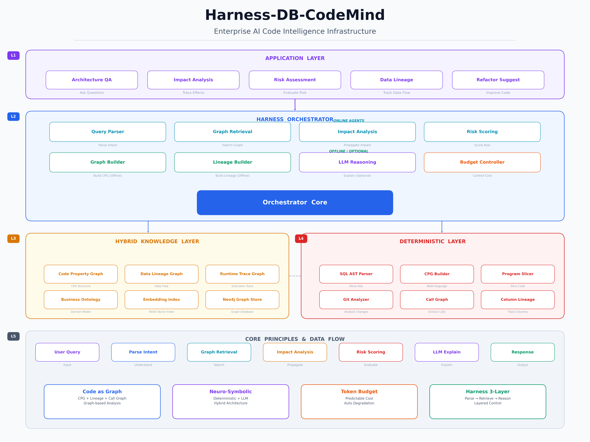

# Harness-DB-CodeMind

**Enterprise AI Code Intelligence Infrastructure**

Transforming enterprise legacy code from black-box text → queryable graph structure assets, achieving **Codebase Digital Twin**.

---

## Table of Contents

- [Core Features](#core-features)
- [System Architecture](#system-architecture)
- [Quick Start](#quick-start)
- [Installation](#installation)
- [Usage Guide](#usage-guide)
  - [CLI Commands](#cli-commands)
  - [Python API](#python-api)
  - [REST API](#rest-api)
- [Core Concepts](#core-concepts)
  - [Code as Graph](#code-as-graph)
  - [Neuro-Symbolic Architecture](#neuro-symbolic-architecture)
  - [Token Budget Control](#token-budget-control)
- [Agent Details](#agent-details)
- [Configuration](#configuration)
- [Testing](#testing)
- [Project Structure](#project-structure)
- [Roadmap](#roadmap)

---

## Core Features

| Capability | Traditional RAG | This System |
|------------|-----------------|-------------|
| Code Structure Understanding | ❌ | ✅ Code Property Graph |
| Token Cost Control | ❌ | ✅ Budget Controller |
| Impact Analysis | ❌ | ✅ BFS + Confidence Propagation |
| Risk Quantification | ❌ | ✅ Multi-factor Risk Scoring |
| Data Lineage | ❌ | ✅ Column-level Lineage Tracking |

---

## System Architecture



```
Application Layer
  ├── Architecture QA
  ├── Impact Analysis
  ├── Risk Assessment
  ├── Data Lineage
  └── Refactor Suggestion

Harness Orchestrator (Core)
  ├── Query Parser Agent      → Natural Language → Structured Query
  ├── Graph Retrieval Agent   → Query-aware Graph Retrieval
  ├── Impact Analysis Agent   → BFS Impact Propagation
  ├── Risk Scoring Agent      → Multi-factor Risk Scoring
  ├── LLM Reasoning Agent     → Semantic Explanation (Optional)
  └── Budget Controller Agent → Token Cost Control

Hybrid Knowledge Layer
  ├── Code Property Graph (CPG)
  ├── Data Lineage Graph
  ├── Runtime Trace Graph
  ├── Business Ontology
  ├── Embedding Index
  └── Neo4j Graph Store

Deterministic Layer
  ├── SQL AST Parser
  ├── CPG Builder
  ├── Program Slicer
  └── Git Analyzer
```

---

## Quick Start

### Prerequisites

- Python 3.10+
- pip

### 30-Second Quick Experience

```bash
# 1. Clone the project
git clone <repo-url>
cd Harness-DB-CodeMind

# 2. Create virtual environment and install
python3 -m venv .venv
source .venv/bin/activate
pip install -e ".[dev]"

# 3. Index test data
codemind index tests/test_data/erp_stored_procedures.sql --language sql

# 4. Execute impact analysis query
codemind query "What does changing orders affect?" --repo tests/test_data/erp_stored_procedures.sql

# 5. Execute risk assessment
codemind query "Risk of modifying m_storage" --repo tests/test_data/erp_stored_procedures.sql

# 6. Start API server
codemind serve --port 8000
```

---

## Installation

### Step 1: Get the Code

```bash
git clone <repo-url>
cd Harness-DB-CodeMind
```

### Step 2: Create Virtual Environment

```bash
python3 -m venv .venv
source .venv/bin/activate  # Linux/macOS
# or
.venv\Scripts\activate     # Windows
```

### Step 3: Install Dependencies

```bash
# Basic installation
pip install -e .

# Development mode (includes testing tools)
pip install -e ".[dev]"
```

### Step 4: Configure Environment Variables

```bash
# Copy example config
cp .env.example .env

# Edit .env file with your configuration
# Required:
#   OPENAI_API_KEY=sk-xxx       # For LLM explanation feature
# Optional:
#   NEO4J_URI=bolt://localhost:7687
#   NEO4J_PASSWORD=your_password
```

### Step 5: Verify Installation

```bash
# Run tests
python tests/test_core.py

# Run ERP tests
python tests/test_erp.py
```

### Optional: Install Neo4j (Graph Database)

For persistent graph storage to Neo4j:

```bash
# Docker installation
docker run -d \
  --name neo4j \
  -p 7474:7474 -p 7687:7687 \
  -e NEO4J_AUTH=neo4j/your_password \
  neo4j:5

# Update .env config
# NEO4J_URI=bolt://localhost:7687
# NEO4J_PASSWORD=your_password
```

---

## Usage Guide

### CLI Commands

#### Index Code Repository

```bash
# Index a single SQL file
codemind index /path/to/procedures.sql --language sql

# Index an entire directory (auto-detects .sql/.java/.py files)
codemind index /path/to/project --language sql

# Index Java project
codemind index /path/to/java-project --language java

# Index Python project
codemind index /path/to/python-project --language python

# Save index results to file
codemind index /path/to/project --output result.json
```

#### Query Code Intelligence

```bash
# Impact analysis
codemind query "What does changing orders table affect?"

# Risk assessment
codemind query "Risk of modifying m_storage"

# Data lineage
codemind query "Data sources of c_invoice"

# Architecture QA
codemind query "What does sp_complete_order do?"

# Specify repository and token budget
codemind query "What does changing order.amount affect?" \
  --repo /path/to/project \
  --budget 4000

# Save query results
codemind query "What does changing orders affect?" --output result.json
```

#### View Statistics

```bash
codemind stats /path/to/project --language sql
```

#### Start API Server

```bash
# Default port 8000
codemind serve

# Specify port
codemind serve --port 9000

# Specify host
codemind serve --host 0.0.0.0 --port 8000
```

### Python API

```python
from codemind.core.orchestrator import Orchestrator

# Create orchestrator
orch = Orchestrator()

# Step 1: Index code repository
result = orch.index_repository("/path/to/project", language="sql")
print(f"Indexing complete: {result['node_count']} nodes, {result['edge_count']} edges")

# Step 2: Execute query
result = orch.query("What does changing orders affect?")

# Parse results
print(f"Query intent: {result['intent']}")
print(f"Identified entities: {result['entities']}")

# Impact analysis results
if "impact" in result:
    impact = result["impact"]
    print(f"Affected nodes: {impact['total_affected']}")
    print(f"Max depth: {impact['max_depth']}")
    print(f"Average confidence: {impact['avg_confidence']:.3f}")

    for imp in impact["impacts"]:
        print(f"  {imp['node_name']} ({imp['node_type']}) "
              f"depth={imp['depth']} confidence={imp['confidence']:.3f}")

# Risk scoring results
if "risk" in result:
    risk = result["risk"]
    print(f"Risk score: {risk['score']}/100")
    print(f"Risk level: {risk['level']}")
    print(f"Risk factors: {risk['factors']}")

# Lineage results
if "lineage" in result:
    lineage = result["lineage"]
    for edge in lineage["lineage_edges"]:
        print(f"  {edge['source']} → {edge['target']} "
              f"[{edge['transformation']}] via={edge['via']}")

# LLM explanation (requires OPENAI_API_KEY)
if "explanation" in result:
    print(f"AI explanation: {result['explanation']}")

# View graph statistics
stats = orch.get_graph_stats()
print(f"Graph stats: {stats}")
```

### REST API

After starting the server, access via HTTP endpoints:

```bash
# Start server
codemind serve --port 8000
```

#### Health Check

```bash
curl http://localhost:8000/health
# {"status": "ok", "service": "harness-db-codemind"}
```

#### Index Repository

```bash
curl -X POST http://localhost:8000/index \
  -H "Content-Type: application/json" \
  -d '{"repo_path": "/path/to/project", "language": "sql"}'
```

#### Query

```bash
curl -X POST http://localhost:8000/query \
  -H "Content-Type: application/json" \
  -d '{"query": "What does changing orders affect?", "budget": 8000}'
```

#### Get Statistics

```bash
curl http://localhost:8000/stats
```

#### Browse Nodes

```bash
# All nodes
curl http://localhost:8000/graph/nodes

# Filter by type
curl http://localhost:8000/graph/nodes?node_type=TABLE

# Search by name
curl http://localhost:8000/graph/nodes?pattern=order
```

#### Browse Edges

```bash
# All edges
curl http://localhost:8000/graph/edges

# Filter by type
curl http://localhost:8000/graph/edges?edge_type=CALL
```

---

## Core Concepts

### Code as Graph

The system transforms code into three graph structures:

1. **Code Property Graph (CPG)**: Function/stored procedure call relationships, read/write relationships
2. **Data Lineage Graph**: Column-level data lineage, tracking data flow
3. **Call Graph**: Inter-procedure call dependencies

Unified Graph Model:

```json
{
  "node": {
    "id": "proc_sp_order_pay",
    "type": "PROCEDURE",
    "name": "sp_order_pay",
    "qualified_name": "sp_order_pay"
  },
  "edge": {
    "source_id": "proc_sp_order_pay",
    "target_id": "table_orders",
    "type": "WRITE",
    "weight": 1.0
  }
}
```

### Neuro-Symbolic Architecture

```
Deterministic Engine (Graph/Rules)     LLM (Semantic Explanation)
┌─────────────────────┐          ┌─────────────────┐
│ SQL AST Parser      │          │ Architecture QA │
│ CPG Builder         │          │ Complex Logic   │
│ Program Slicer      │          │ Natural Language│
│ Impact Propagation  │          │ Generation      │
│ Risk Scoring        │          │                 │
└─────────────────────┘          └─────────────────┘
       ↑ Computable, Deterministic      ↑ Non-computable, Semantic
       ↑ Zero Token Cost                ↑ Token Cost
```

**Core Principle**: LLM only participates in "non-computable parts", enabling predictable token consumption.

### Token Budget Control

Each query has a budget, with automatic degradation when exceeded:

```
Token Estimation Formula: Token = Nodes × 25 + Edges × 10

Degradation Strategy:
  Over budget → Reduce graph depth (REDUCE_DEPTH)
             → Disable LLM (NO_LLM)
             → Minimize output (MINIMAL)
```

---

## Agent Details

| Agent | Type | Responsibility |
|-------|------|----------------|
| Graph Builder | Offline | Build CPG + Call Graph, supports SQL/Java/Python |
| Lineage Builder | Offline | Parse SQL AST, build column-level lineage |
| Query Parser | Online | Natural Language → Structured Query (Intent + Entities + Constraints) |
| Graph Retrieval | Online | Query-aware graph retrieval, BFS + Ranking |
| Impact Analysis | Online | BFS + confidence decay impact propagation |
| Risk Scoring | Online | Multi-factor risk scoring (6 dimensions) |
| LLM Reasoning | Online/Optional | Semantic explanation, triggered only when needed |
| Budget Controller | Online | Token budget allocation and degradation strategy |

### Impact Propagation Algorithm

```
BFS + confidence decay:

new_confidence = parent_confidence × edge_weight

edge_weight by type:
  LINEAGE: 0.95    WRITE: 0.85    CALL: 0.90
  READ: 0.70       REFERENCES: 0.60

Nodes below threshold (default 0.1) are pruned
```

### Risk Scoring Formula

```
Risk = Σ(wi × fi)

Factors and Default Weights:
  blast_radius     (0.25)  - Impact scope
  critical_path    (0.20)  - Core path involvement
  data_sensitivity (0.20)  - Data sensitivity
  change_frequency (0.15)  - Change frequency
  coupling         (0.10)  - Coupling degree
  test_coverage    (0.10)  - Test coverage

Risk Levels:
  CRITICAL: ≥75    HIGH: ≥55    MEDIUM: ≥30    LOW: <30
```

---

## Configuration

All configuration is managed through `.env` file or environment variables:

| Variable | Default | Description |
|----------|---------|-------------|
| `NEO4J_URI` | bolt://localhost:7687 | Neo4j connection URI |
| `NEO4J_USER` | neo4j | Neo4j username |
| `NEO4J_PASSWORD` | password | Neo4j password |
| `OPENAI_API_KEY` | | OpenAI API Key (required for LLM features) |
| `OPENAI_MODEL` | gpt-4 | LLM model to use |
| `OPENAI_BASE_URL` | https://api.openai.com/v1 | API base URL |
| `EMBEDDING_MODEL` | all-MiniLM-L6-v2 | Embedding model name |
| `TOKEN_BUDGET_DEFAULT` | 8000 | Default token budget |
| `TOKEN_BUDGET_MAX` | 16000 | Maximum token budget |
| `IMPACT_CONFIDENCE_THRESHOLD` | 0.1 | Impact propagation confidence threshold |
| `IMPACT_MAX_DEPTH` | 5 | Maximum impact propagation depth |
| `RISK_WEIGHT_BLAST_RADIUS` | 0.25 | Risk factor: blast radius weight |
| `RISK_WEIGHT_CRITICAL_PATH` | 0.20 | Risk factor: critical path weight |
| `RISK_WEIGHT_DATA_SENSITIVITY` | 0.20 | Risk factor: data sensitivity weight |
| `RISK_WEIGHT_CHANGE_FREQUENCY` | 0.15 | Risk factor: change frequency weight |
| `RISK_WEIGHT_COUPLING` | 0.10 | Risk factor: coupling weight |
| `RISK_WEIGHT_TEST_COVERAGE` | 0.10 | Risk factor: test coverage weight |

---

## Testing

The project includes two test datasets:

### Basic Tests

```bash
python tests/test_core.py
```

Test coverage:
- SQL Parser: INSERT/SELECT/UPDATE statement parsing
- CPG Builder: Code graph construction
- Program Slicer: Forward/backward slicing
- Query Parser: Intent recognition and entity extraction
- Lineage Builder: Data lineage extraction
- Budget Controller: Budget control
- Orchestrator: End-to-end integration

### ERP Enterprise Tests

```bash
python tests/test_erp.py
```

Tests using 8 complex stored procedures simulating real ERP systems (based on ADempiere/iDempiere patterns):

| Stored Procedure | Function | Complexity |
|------------------|----------|------------|
| `sp_complete_order` | Order completion | Multi-table updates + cascading operations + accounting entries |
| `sp_generate_invoice` | Invoice generation | Order→Invoice + tax calculation |
| `sp_process_payment` | Payment processing | Credit updates + accounting entries |
| `sp_move_inventory` | Inventory movement | Inter-warehouse transfers + transaction records |
| `sp_close_period` | Month-end closing | Period closure + balance calculation + trial balance |
| `sp_update_product_cost` | Product cost calculation | Weighted average cost + cost history |
| `fn_check_credit` | Customer credit check | Credit limit assessment (function) |
| `sp_update_pricelist` | Price list calculation | Batch price updates + margin calculation |

**Sample Test Results**:

```
Index result: nodes=145, edges=60, tokens=4225

Impact Analysis - Changing orders table:
  Affected nodes: 22
  Max depth: 4
  Average confidence: 0.501
  Affected nodes:
    - sp_complete_order (PROCEDURE) depth=1 conf=0.680
    - sp_generate_invoice (PROCEDURE) depth=1 conf=0.560
    - m_inventory (TABLE) depth=2 conf=0.578
    - m_storage (TABLE) depth=2 conf=0.578
    - fact_acct (TABLE) depth=2 conf=0.578
    - c_bpartner (TABLE) depth=2 conf=0.578
  Risk score: 87.0/100 level=CRITICAL
```

---

## Project Structure

```
Harness-DB-CodeMind/
├── codemind/
│   ├── __init__.py
│   ├── cli.py                          # CLI entry point (click + rich)
│   ├── core/
│   │   ├── __init__.py
│   │   ├── models.py                   # Core data models (Node/Edge/Graph/...)
│   │   ├── config.py                   # Configuration management (singleton)
│   │   └── orchestrator.py             # Core orchestration engine
│   ├── agents/
│   │   ├── __init__.py
│   │   ├── base.py                     # Agent base class
│   │   ├── graph_builder.py            # Code graph builder agent
│   │   ├── lineage_builder.py          # SQL lineage builder agent
│   │   ├── query_parser.py             # Query parser agent
│   │   ├── graph_retrieval.py          # Graph retrieval agent
│   │   ├── impact_analysis.py          # Impact analysis agent
│   │   ├── risk_scoring.py             # Risk scoring agent
│   │   ├── llm_reasoning.py            # LLM reasoning agent
│   │   └── budget_controller.py        # Budget controller agent
│   ├── deterministic/
│   │   ├── __init__.py
│   │   ├── sql_parser.py               # SQL AST parser
│   │   ├── cpg_builder.py              # CPG builder (multi-language)
│   │   ├── program_slicer.py           # Program slicer
│   │   └── git_analyzer.py             # Git analyzer
│   ├── knowledge/
│   │   ├── __init__.py
│   │   ├── neo4j_store.py              # Neo4j graph store
│   │   └── embedding_index.py          # Vector index (FAISS)
│   └── api/
│       ├── __init__.py
│       └── server.py                   # FastAPI service
├── tests/
│   ├── __init__.py
│   ├── test_core.py                    # Core functionality tests
│   ├── test_erp.py                     # ERP scenario tests
│   └── test_data/
│       ├── ecommerce_procedures.sql    # E-commerce stored procedures
│       └── erp_stored_procedures.sql   # ERP stored procedures
├── pyproject.toml                      # Project configuration
├── .env.example                        # Environment variable example
├── .gitignore
├── README.md                           # Chinese documentation
├── README_EN.md                        # English documentation
├── architecture.png                    # Architecture diagram (Chinese)
├── architecture_en.png                 # Architecture diagram (English)
└── structure.md                        # Architecture design document
```

---

## Roadmap

1. **Change Decision Engine**: Release gate, change decision engine
2. **Automatic Refactoring Suggestions**: Refactoring opportunity identification based on graph patterns
3. **Self-learning Weights**: Adjust risk factor weights based on historical incident data
4. **Runtime + Static Fusion Analysis**: Combine runtime tracing with static analysis
5. **Multi-repository Cross-system Analysis**: Global impact analysis across microservices
6. **More Language Support**: Go, Rust, C#, etc.
7. **Web UI**: Visual graph browser and interactive query interface

---

## License

MIT License
